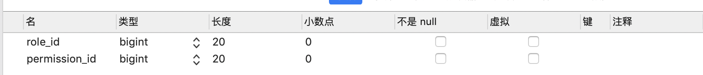

# 一、权限控制概述

## 1.1、访问控制目的

在实际的组织中，为了完成组织的业务工作，需要在组织内部设置不同的职位，职位既表示一种业务分工，又表示一种责任与权利。根据业务分工的需要，职位被划分给不同群体，各个群体的人根据其工作任务的需要被赋予不同的职责和权利，每个人有权了解与使用与自己任务相关的信息与资源，对于那些不应该被知道的信息则应该限制他们访问。这就产生了访问控制的需求。

限制主体对资源的访问，限制用户可以访问而且只能访问自己被授权的资源，从而保障数据资源在合法范围内得以有效使用和管理。权限管理几乎出现在任何系统里面，只要有用户和密码的系统。

## 1.2、访问控制策略

在权限管理中使用最多的还是基于角色访问控制（RBAC：Role Based Access Control）。基于角色的访问控制，是 20 世纪 90 年代研究出来的一种模型。这种模型的基本概念是把许可权（Permission）与角色（Role）联系在一起，用户通过充当合适角色的成员而获得该角色的许可权。

例如，在一间公司中，有老板、经理、行政、人事、财务等不同的职位，在通常情况下，职位所赋予的权利是不变的，但在某个职位上工作的人可以根据需要调整。RBAC 模型对组织内部的这些关系与访问控制要求给出了非常恰当的描述。

## 1.3、RBAC 重要对象

- 用户（Employee）：角色施加的主体；用户通过拥有某个或多个角色以得到对应的权限。
- 角色（Role）：表示一组权限的集合。
- 权限（Permission）：一个资源代表一个权限，是否能访问该资源，就是看是否有该权限。


## 1.4、RBAC 流程与模型分析

管理员可为用户分配角色和权限（用户、角色和权限数据还有其之间关系数据都得保存起来）。

> 动手画流程图分析以及模型图。

## 1.5、项目演示

观察演示项目文档, 搞清楚项目要做哪些功能有哪些模块


# 二、搭建项目

## 2.1、技术选型

在项目开发前，需要对技术方案先做方向性的评估。在投资有限、硬件资源有限的条件下，为了满足需求，需要进行技术方案选型、技术点使用范围进行分析。也就是需要选择哪种类型脚手架(包含哪些技术的脚手架)

**常见的技术选型度量点：**

（1）快速开发

（2）学习成本低

（3）技术成熟度

（4）稳定性

（5）性能

当前项目技术架构：

后端框架：Springboot 、MyBatis、Spring

前端框架：Vue 、elementUi 、es6 、axios

数据库： MySQL、Redis

项目结构:  前后端分离

## 2.2、导入依赖

```xml
 <parent>
        <groupId>org.springframework.boot</groupId>
        <artifactId>spring-boot-starter-parent</artifactId>
        <version>2.3.3.RELEASE</version>
        <relativePath/> <!-- lookup parent from repository -->
    </parent>
    <dependencies>
        <dependency>
            <groupId>org.springframework.boot</groupId>
            <artifactId>spring-boot-starter</artifactId>
        </dependency>
        <dependency>
            <groupId>org.springframework.boot</groupId>
            <artifactId>spring-boot-starter-web</artifactId>
        </dependency>
        <dependency>
            <groupId>org.projectlombok</groupId>
            <artifactId>lombok</artifactId>
            <optional>true</optional>
        </dependency>
        <dependency>
            <groupId>org.springframework.boot</groupId>
            <artifactId>spring-boot-starter-test</artifactId>
            <scope>test</scope>
        </dependency>
        <dependency>
            <groupId>com.alibaba</groupId>
            <artifactId>druid-spring-boot-starter</artifactId>
            <version>1.1.21</version>
        </dependency>
        <dependency>
            <groupId>org.springframework.boot</groupId>
            <artifactId>spring-boot-starter-jdbc</artifactId>
        </dependency>
        <dependency>
            <groupId>mysql</groupId>
            <artifactId>mysql-connector-java</artifactId>
            <scope>runtime</scope>
        </dependency>
        <!-- Mybatis 集成到 SpringBoot 中的依赖 -->
        <dependency>
            <groupId>org.mybatis.spring.boot</groupId>
            <artifactId>mybatis-spring-boot-starter</artifactId>
            <version>1.3.1</version>
        </dependency>
        <dependency>
            <groupId>com.github.pagehelper</groupId>
            <artifactId>pagehelper-spring-boot-starter</artifactId>
            <version>1.3.0</version>
        </dependency>
        <!-- 引入 redis 依赖 -->
        <dependency>
            <groupId>org.springframework.boot</groupId>
            <artifactId>spring-boot-starter-data-redis</artifactId>
        </dependency>
        <!-- lettuce 缓存连接池-->
        <dependency>
            <groupId>org.apache.commons</groupId>
            <artifactId>commons-pool2</artifactId>
        </dependency>
        <!-- https://mvnrepository.com/artifact/commons-codec/commons-codec -->
        <dependency>
            <groupId>commons-codec</groupId>
            <artifactId>commons-codec</artifactId>
            <version>1.15</version>
        </dependency>
       <dependency>
            <groupId>com.alibaba</groupId>
            <artifactId>fastjson</artifactId>
            <version>1.2.83</version>
        </dependency>
    </dependencies>

    <build>
        <plugins>
            <!-- MyBatis 的 generator 插件-->
            <plugin>
                <groupId>org.mybatis.generator</groupId>
                <artifactId>mybatis-generator-maven-plugin</artifactId>
                <version>1.3.2</version>
                <configuration>
                    <verbose>true</verbose>
                    <overwrite>false</overwrite>
                </configuration>
                <dependencies>
                    <dependency>
                        <groupId>mysql</groupId>
                        <artifactId>mysql-connector-java</artifactId>
                        <version>5.1.45</version>
                    </dependency>
                </dependencies>
            </plugin>
        </plugins>
    </build>
```

## 2.3、加入配置

```yml
spring:
  datasource:
    driver-class-name: com.mysql.jdbc.Driver
    url: jdbc:mysql://localhost:3306/rbac?useUnicode=true&characterEncoding=utf8&serverTimezone=GMT%2B8
    username: root
    password: admin
    # redis 配置
  redis:
    # 地址
    host: 127.0.0.1
    # 端口，默认为6379
    port: 6379
    # 数据库索引
    database: 0
    # 密码
    password:
    # 连接超时时间
    timeout: 10s
    lettuce:
      pool:
        # 连接池中的最小空闲连接
        min-idle: 0
        # 连接池中的最大空闲连接
        max-idle: 8
        # 连接池的最大数据库连接数
        max-active: 8
        # #连接池最大阻塞等待时间（使用负值表示没有限制）
        max-wait: -1ms
server:
  port: 8080
mybatis:
  type-aliases-package: com.izumi.domain
logging:
  level:
    root: info
    com:
      izumi:
         mapper: trace
```

## 2.4、创建启动类

```java
@SpringBootApplication
@MapperScan(basePackages = "com.izumi.mapper")
public class App {

    public static void main(String[] args) {
        SpringApplication.run(App.class,args);
    }
}
```

# 三、部门管理

部门表：department


## 3.1、 部门列表

前端界面


后端接口：

| **功能描述** | 部门分页查询                                                           |                                                                                                                                                                                                                                                                                                                                             |         |
| -------- | ---------------------------------------------------------------- | ------------------------------------------------------------------------------------------------------------------------------------------------------------------------------------------------------------------------------------------------------------------------------------------------------------------------------------------- | ------- |
| URL      | <http://localhost:8080/api/department/list?pageNum=1&pageSize=5> |                                                                                                                                                                                                                                                                                                                                             |         |
| 请求方式     | get                                                              |                                                                                                                                                                                                                                                                                                                                             |         |
| 参数名      | 必填                                                               | 类型                                                                                                                                                                                                                                                                                                                                          | 描述      |
| pageNum  | 否                                                                | int                                                                                                                                                                                                                                                                                                                                         | 当前页     |
| pageSize | 否                                                                | int                                                                                                                                                                                                                                                                                                                                         | 每页显示多少条 |
| **返回**   |                                                                  |                                                                                                                                                                                                                                                                                                                                             |         |
| 参数名      | 类型                                                               | 描述                                                                                                                                                                                                                                                                                                                                          |         |
| code     | int                                                              | 200成功，401认证失败，403无权限操作，500失败                                                                                                                                                                                                                                                                                                                |         |
| msg      | string                                                           | 操作提示信息                                                                                                                                                                                                                                                                                                                                      |         |
| status   | string                                                           | success 成功，fail 失败                                                                                                                                                                                                                                                                                                                          |         |
| data     | object                                                           | {        "pageNum": 1,当前页        "pageSize": 2,每页数据        "list": [            {                "id": 1,部门标识                "name": "人力资源部",部门名称                "sn": "Human Resources Department" 部门简称            }        ],        "total": 6 总条数  }                                                                                    |         |
| 样例       |                                                                  | {    "code": 200,状态码    "msg": "",操作提示信息    "status": "success",操作状态    "data": {        "pageNum": 1,当前页        "pageSize": 2,每页数据        "list": [            {                "id": 1,部门标识                "name": "人力资源部",部门名称                "sn": "Human Resources Department" 部门简称            }        ],        "total": 6 总条数    }} |         |

**代码：**

根据后台接口文档创建出来返回对象

```java
@Data
@AllArgsConstructor
@NoArgsConstructor
public class R {
    private int code;// 状态码:200成功,500失败
    private String status;// 状态
    private String msg;// 响应提示的信息
    private Object data;// 响应的具体内容
    public static final String SUCCESS = "success";
    public static final String FAIL = "fail";

    public static R ok() {
        return new R(200, SUCCESS, "", null);
    }

    public static R ok(String msg, Object data) {
        return new R(200, SUCCESS, msg, data);
    }

    public static R ok(Object data) {
        return new R(200, SUCCESS, "", data);
    }

    public static R fail() {
        return new R(500, FAIL, "", null);
    }

    public static R fail(String msg) {
        return new R(500, FAIL, msg,null);
    }
}
```

把数据封装到 R 对象中在 controller

```java
@GetMapping("/list")
public R query(QueryObject queryObject){

    PageResult result = departmentService.query(queryObject);

    Result r = new Result(result.getTotal(),result.getList(),queryObject.getPageNum(),queryObject.getPageSize());
    return R.ok(r);

}
```

测试： 使用 postman 访问http://localhost:8080/api/department/list?pageNum=1&pageSize=5看数据返回值是否正确

## 3.2 、PageHelper

[PageHelper](https://pagehelper.github.io/) 是一个 MyBatis 的分页插件，负责将已经写好的 SQL 语句，进行分页加工。无需自己去封装以及关心 SQL 分页等问题，使用很方便。

> 在一个新项目中加入该分页插件，实现分页功能。

### 3.2.1、添加依赖

```xml
<dependency>
    <groupId>com.github.pagehelper</groupId>
    <artifactId>pagehelper-spring-boot-starter</artifactId>
    <version>1.3.0</version>
</dependency>
```

### 3.2.2、配置分页插件

修改 application.properties，如下配置：

```yaml
pagehelper:
  reasonable: true
  page-size-zero: true
```

### 3.2.3、实现分页

- 删除 Mapper.xml 文件中查询数量的代码。

- 删除 Mapper.xml 文件的分页查询的 SQL 中的 Limit 子句，QueryObject 中也不需要提供 getStart 方法了。

- 使用分页插件提供的 PageInfo 类进行封装，不需要自己再定义 PageResult 类了。
  
  ```java
  public PageInfo<Department> query(QueryObject qo) {
      // 使用分页插件，传入当前页，每页显示数量
      PageHelper.startPage(qo.getCurrentPage(), qo.getPageSize());
      List<Department> departments = departmentMapper.selectForList(qo);
      return new PageInfo(departments);
  }
  ```

### 3.2.4、DepartmentController 修改

```java
@GetMapping("/list")
    public R query(QueryObject queryObject){

        PageInfo pageinfo = departmentService.query(queryObject);
        Result r = new Result(pageinfo.getTotal(),pageinfo.getList(),queryObject.getPageNum(),queryObject.getPageSize());
        return R.ok(r);

    }
```

测试： 使用 postman 测试看是否正确http://localhost:8080/api/department/list?pageNum=1&pageSize=5

### 3.2.5 PageHelper 原理解析

画图分析

## 3.3 、部门删除

前台界面：


后台接口：

| **功能描述** | 删除部门信息                                           |                                                                                           |      |
| -------- | ------------------------------------------------ | ----------------------------------------------------------------------------------------- | ---- |
| URL      | <http://localhost:8080/api/department/delete/11> |                                                                                           |      |
| 请求方式     | delete                                           |                                                                                           |      |
| 参数名      | 必填                                               | 类型                                                                                        | 描述   |
| id       | 是                                                | int                                                                                       | 部门标识 |
| **返回**   |                                                  |                                                                                           |      |
| 参数名      | 类型                                               | 描述                                                                                        |      |
| code     | int                                              | 200成功，401认证失败，403无权限操作，500失败                                                              |      |
| msg      | string                                           | 操作提示信息                                                                                    |      |
| status   | string                                           | success 成功，fail 失败                                                                        |      |
| data     | object                                           | null                                                                                      |      |
| 样例       |                                                  | {    "code": 200,状态码    "msg": "删除成功",操作提示信息    "status": "success",操作状态    "data": null} |      |

代码：

```java
@DeleteMapping("/delete/{id}")
public R delete(@PathVariable Long id){
    departmentService.deleteByPrimaryKey(id);
    return R.ok();
}
```

测试：使用 postman 访问http://localhost:8080/api/department/delete/11>  

## 3.4、部门新增和编辑

前台界面：


后台接口：

| **功能描述**   | 保存或更新部门信息                                                                                           |                                                                                               |                                                                                                                               |
| ---------- | --------------------------------------------------------------------------------------------------- | --------------------------------------------------------------------------------------------- | ----------------------------------------------------------------------------------------------------------------------------- |
| URL        | [http://localhost:8080/api/department/saveOrUpdate](http://localhost:8080/api/department/delete/11) |                                                                                               |                                                                                                                               |
| 请求方式       | post                                                                                                |                                                                                               |                                                                                                                               |
| 参数名        | 必填                                                                                                  | 类型                                                                                            | 描述                                                                                                                            |
| department | 是                                                                                                   | json                                                                                          | 添加 {   "name": "总裁办",部门名称   "sn": "President" 部门简称 }更新 {   "id": "12",部门标识   "name": "总裁办1",部门名称   "sn": "President1" 部门简称  } |
| **返回**     |                                                                                                     |                                                                                               |                                                                                                                               |
| 参数名        | 类型                                                                                                  | 描述                                                                                            |                                                                                                                               |
| code       | int                                                                                                 | 200成功，401认证失败，403无权限操作，500失败                                                                  |                                                                                                                               |
| msg        | string                                                                                              | 操作提示信息                                                                                        |                                                                                                                               |
| status     | string                                                                                              | success 成功，fail 失败                                                                            |                                                                                                                               |
| data       | object                                                                                              | null                                                                                          |                                                                                                                               |
| 样例         |                                                                                                     | {    "code": 200,状态码    "msg": "保存或者更新成功",操作提示信息    "status": "success",操作状态    "data": null} |                                                                                                                               |

**代码：**

```java
@PostMapping("/saveOrUpdate")
    public R saveOrUpdate(@RequestBody Department department){
        if(department.getId() == null){
            departmentService.insert(department);
        }else{
            departmentService.updateByPrimaryKey(department);
        }
        return R.ok();
    }
```

测试： 使用 postman测试 [http://localhost:8080/api/department/saveOrUpdate](http://localhost:8080/api/department/delete/11) 

## 3.5、查询单个部门

| **功能描述** | 获取部门信息                                                                                        |                                                                                                                                                                                            |      |
| -------- | --------------------------------------------------------------------------------------------- | ------------------------------------------------------------------------------------------------------------------------------------------------------------------------------------------ | ---- |
| URL      | [http://localhost:8080/api/department/info/1](http://localhost:8080/api/department/delete/11) |                                                                                                                                                                                            |      |
| 请求方式     | get                                                                                           |                                                                                                                                                                                            |      |
| 参数名      | 必填                                                                                            | 类型                                                                                                                                                                                         | 描述   |
| id       | 是                                                                                             | int                                                                                                                                                                                        | 部门标识 |
| **返回**   |                                                                                               |                                                                                                                                                                                            |      |
| 参数名      | 类型                                                                                            | 描述                                                                                                                                                                                         |      |
| code     | int                                                                                           | 200成功，401认证失败，403无权限操作，500失败                                                                                                                                                               |      |
| msg      | string                                                                                        | 操作提示信息                                                                                                                                                                                     |      |
| status   | string                                                                                        | success 成功，fail 失败                                                                                                                                                                         |      |
| data     | object                                                                                        | {        "id": 1,部门标识        "name": "人力资源部",部门名称        "sn": "Human Resources Department" 部门简称  }                                                                                        |      |
| 样例       |                                                                                               | {    "code": 200,状态码    "msg": "删除成功",操作提示信息    "status": "success",操作状态    "data": {        "id": 1,部门标识        "name": "人力资源部",部门名称        "sn": "Human Resources Department" 部门简称    }} |      |

**代码：**

```java
  @GetMapping("/info/{id}")
    public R get(@PathVariable Long id){
        Department department = departmentService.selectByPrimaryKey(id);
        return R.ok(department);
    }
```

测试：使用 postman 测试 [http://localhost:8080/api/department/info/1](http://localhost:8080/api/department/delete/11) 

## 3.6、查询所有部门的

| **功能描述** | 查询所有部门                                                                                                         |                                                                                                                                                                                                    |     |
| -------- | -------------------------------------------------------------------------------------------------------------- | -------------------------------------------------------------------------------------------------------------------------------------------------------------------------------------------------- | --- |
| URL      | [http://localhost:8080/api/department/listAll](http://localhost:8080/api/department/list?pageNum=1&pageSize=5) |                                                                                                                                                                                                    |     |
| 请求方式     | get                                                                                                            |                                                                                                                                                                                                    |     |
| 参数名      | 必填                                                                                                             | 类型                                                                                                                                                                                                 | 描述  |
| 无        | 无                                                                                                              | 无                                                                                                                                                                                                  | 无   |
| **返回**   |                                                                                                                |                                                                                                                                                                                                    |     |
| 参数名      | 类型                                                                                                             | 描述                                                                                                                                                                                                 |     |
| code     | int                                                                                                            | 200成功，401认证失败，403无权限操作，500失败                                                                                                                                                                       |     |
| msg      | string                                                                                                         | 操作提示信息                                                                                                                                                                                             |     |
| status   | string                                                                                                         | success 成功，fail 失败                                                                                                                                                                                 |     |
| data     | array                                                                                                          | [        {            "id": 1,            "name": "人力资源部",            "sn": "Human Resources Department"        }]                                                                                 |     |
| 样例       |                                                                                                                | {    "code": 200,状态码    "msg": "",操作提示信息    "status": "success",操作状态    "data":[        {            "id": 1,            "name": "人力资源部",            "sn": "Human Resources Department"        }]} |     |

**代码：**

```java
@GetMapping("/listAll")
public R listAll(QueryObject queryObject){

    List<Department> list = departmentService.selectAll();
    return R.ok(list);
}
```

测试： 使用 postman测试 [http://localhost:8080/api/department/listAll](http://localhost:8080/api/department/list?pageNum=1&pageSize=5) 

## 3.7、接口统一异常处理

当我们 service 中判断抛出异常的时候发现返回信息和预期是不一致的

比如：

```java
 public int deleteByPrimaryKey(Long id) {
        int i = 1/0;
        return departmentMapper.deleteByPrimaryKey(id);
}
```

观察结果发现：


统一异常处理类：

```java
//@ControllerAdvice
public class CommonControllerAdvice {

    @ExceptionHandler(RuntimeException.class)
    @ResponseBody
    public R handler(RuntimeException e){
        e.printStackTrace();
        return R.fail("系统异常");
    }
}
```

在进行测试：


测试结果数据已经回复正常了， 但是有一个问题，现在所有的信息都为系统异常了， 有一些错误信息我是想要让用户看到的，比如密码错误，账号不存在这些错误信息。

解决： 自定义异常， 框架内部的错误就返回系统异常， 如果是想要让用户看到的信息就自己抛出异常

**自定义异常类：**

```java
public class BusinessException extends RuntimeException {

    public BusinessException() {
    }

    public BusinessException(String message) {
        super(message);
    }
}
```

**Service：**

```java
public int deleteByPrimaryKey(Long id) {
if(1==1){
    throw new BusinessException("id 不为空");
}
return departmentMapper.deleteByPrimaryKey(id);
}
```

**异常处理类：**

```java
@ExceptionHandler(BusinessException.class)
@ResponseBody
public R handler1(RuntimeException e){
    e.printStackTrace();
    return R.fail(e.getMessage());
}
```

测试：


# 四、员工管理

员工表：employee


## 4.1 、员工列表

前台界面


后台接口

| **功能描述** | 员工分页条件查询                                                                                                                       |                                                                                                                                                                                                                                                                                                                                                                                                                                                                                                                                                                                                                                  |                |
| -------- | ------------------------------------------------------------------------------------------------------------------------------ | -------------------------------------------------------------------------------------------------------------------------------------------------------------------------------------------------------------------------------------------------------------------------------------------------------------------------------------------------------------------------------------------------------------------------------------------------------------------------------------------------------------------------------------------------------------------------------------------------------------------------------- | -------------- |
| URL      | [http://localhost:8080/api/employee/list?pageNum=1&pageSize=5](http://localhost:8080/api/department/list?pageNum=1&pageSize=5) |                                                                                                                                                                                                                                                                                                                                                                                                                                                                                                                                                                                                                                  |                |
| 请求方式     | get                                                                                                                            |                                                                                                                                                                                                                                                                                                                                                                                                                                                                                                                                                                                                                                  |                |
| 参数名      | 必填                                                                                                                             | 类型                                                                                                                                                                                                                                                                                                                                                                                                                                                                                                                                                                                                                               | 描述             |
| pageNum  | 否                                                                                                                              | int                                                                                                                                                                                                                                                                                                                                                                                                                                                                                                                                                                                                                              | 当前页            |
| pageSize | 否                                                                                                                              | int                                                                                                                                                                                                                                                                                                                                                                                                                                                                                                                                                                                                                              | 每页显示多少条        |
| deptId   | 否                                                                                                                              | int                                                                                                                                                                                                                                                                                                                                                                                                                                                                                                                                                                                                                              | 部门id           |
| keyword  | 否                                                                                                                              | string                                                                                                                                                                                                                                                                                                                                                                                                                                                                                                                                                                                                                           | 模糊查询关键字(姓名或邮箱) |
| **返回**   |                                                                                                                                |                                                                                                                                                                                                                                                                                                                                                                                                                                                                                                                                                                                                                                  |                |
| 参数名      | 类型                                                                                                                             | 描述                                                                                                                                                                                                                                                                                                                                                                                                                                                                                                                                                                                                                               |                |
| code     | int                                                                                                                            | 200成功，401认证失败，403无权限操作，500失败                                                                                                                                                                                                                                                                                                                                                                                                                                                                                                                                                                                                     |                |
| msg      | string                                                                                                                         | 操作提示信息                                                                                                                                                                                                                                                                                                                                                                                                                                                                                                                                                                                                                           |                |
| status   | string                                                                                                                         | success 成功，fail 失败                                                                                                                                                                                                                                                                                                                                                                                                                                                                                                                                                                                                               |                |
| data     | object                                                                                                                         | {        "pageNum": 1,当前页        "pageSize": 2,每页数据        "list": [           {                "id": 1,员工标识                "name": "admin",员工名称                "password": null,员工密码                "email": "admin@qq.com",员工邮箱                "age": 18,员工年龄                "admin": true,是否为管理员                "department": { 部门信息                    "id": 1,部门标识                    "name": "人力资源部",部门名称                    "sn": "Human Resources Department" 部门简称                }            }         ],        "total": 21 总条数    }                                                                                  |                |
| 样例       |                                                                                                                                | {    "code": 200,状态码    "msg": "",操作提示信息    "status": "success",操作状态    "data": {        "pageNum": 1,当前页        "pageSize": 2,每页数据        "list": [           {                "id": 1,员工标识                "name": "admin",员工名称                "password": null,员工密码                "email": "admin@qq.com",员工邮箱                "age": 18,员工年龄                "admin": true,是否为管理员                "department": { 部门信息                    "id": 1,部门标识                    "name": "人力资源部",部门名称                    "sn": "Human Resources Department" 部门简称                }            }         ],        "total": 21 总条数    }} |                |

代码：

```java
@GetMapping("/list")
public R query(EmployeeQueryObject queryObject){

    PageInfo pageinfo = employeeService.query(queryObject);
    Result r = new Result(pageinfo.getTotal(),pageinfo.getList(),queryObject.getPageNum(),queryObject.getPageSize());
    return R.ok(r);

}
```

测试：使用 postman 访问 [http://localhost:8080/api/employee/list?pageNum=1&pageSize=5](http://localhost:8080/api/department/list?pageNum=1&pageSize=5) 

## 4.2 、员工高级查询

创建 EmployeeQueryObject

```java
@Setter
@Getter
public class EmployeeQueryObject extends QueryObject {
    private String keyword; // 关键字
    private Long deptId; // 部门 id

}
```

xml 文件加条件

```xml
 <sql id="where_sql">
        <where>
            <if test="keyword != null and keyword !=''">
                AND (e.name like concat('%', #{keyword}, '%') or e.email like concat('%', #{keyword}, '%'))
            </if>
            <if test="deptId != null">
                AND e.dept_id = #{deptId}
            </if>
        </where>
    </sql>
```

## 4.3 、员工删除

前端界面


后台接口：

| **功能描述** | 删除员工信息                                                                                         |                                                                                           |      |
| -------- | ---------------------------------------------------------------------------------------------- | ----------------------------------------------------------------------------------------- | ---- |
| URL      | [http://localhost:8080/api/employee/delete/11](http://localhost:8080/api/department/delete/11) |                                                                                           |      |
| 请求方式     | delete                                                                                         |                                                                                           |      |
| 参数名      | 必填                                                                                             | 类型                                                                                        | 描述   |
| id       | 是                                                                                              | int                                                                                       | 部门标识 |
| **返回**   |                                                                                                |                                                                                           |      |
| 参数名      | 类型                                                                                             | 描述                                                                                        |      |
| code     | int                                                                                            | 200成功，401认证失败，403无权限操作，500失败                                                              |      |
| msg      | string                                                                                         | 操作提示信息                                                                                    |      |
| status   | string                                                                                         | success 成功，fail 失败                                                                        |      |
| data     | object                                                                                         | null                                                                                      |      |
| 样例       |                                                                                                | {    "code": 200,状态码    "msg": "删除成功",操作提示信息    "status": "success",操作状态    "data": null} |      |

**代码：**

```java
   @DeleteMapping("/delete/{id}")
    public R delete(@PathVariable Long id){
        employeeService.delete(id);
        return R.ok();
    }
```

测试：使用 postman发送http://localhost:8080/api/employee/delete/11](http://localhost:8080/api/department/delete/11) 

### 4.3.1 删除关系

由于员工和角色之间是存在多对多的关系的， 关系存在中间表中， 如果员工不存在了， 中间表的数据也应该删除掉

代码：

```java
 @Override
    public void delete(Long id) {
        employeeMapper.deleteByPrimaryKey(id);
        employeeMapper.deleteRelation(id);
    }
```

Xml:

```xml
<delete>
delete id="deleteRelation">
    delete from employee_role where employee_id = #{id}
</delete>
```

## 4.4 、查询单个员工

后台接口：

| **功能描述** | 获取员工信息                                                                                       |                                                                                                                                                                                                                                                                                                                                                                                                   |      |
| -------- | -------------------------------------------------------------------------------------------- | ------------------------------------------------------------------------------------------------------------------------------------------------------------------------------------------------------------------------------------------------------------------------------------------------------------------------------------------------------------------------------------------------- | ---- |
| URL      | [http://localhost:8080/api/employee/info/11](http://localhost:8080/api/department/delete/11) |                                                                                                                                                                                                                                                                                                                                                                                                   |      |
| 请求方式     | get                                                                                          |                                                                                                                                                                                                                                                                                                                                                                                                   |      |
| 参数名      | 必填                                                                                           | 类型                                                                                                                                                                                                                                                                                                                                                                                                | 描述   |
| id       | 是                                                                                            | int                                                                                                                                                                                                                                                                                                                                                                                               | 员工标识 |
| **返回**   |                                                                                              |                                                                                                                                                                                                                                                                                                                                                                                                   |      |
| 参数名      | 类型                                                                                           | 描述                                                                                                                                                                                                                                                                                                                                                                                                |      |
| code     | int                                                                                          | 200成功，401认证失败，403无权限操作，500失败                                                                                                                                                                                                                                                                                                                                                                      |      |
| msg      | string                                                                                       | 操作提示信息                                                                                                                                                                                                                                                                                                                                                                                            |      |
| status   | string                                                                                       | success 成功，fail 失败                                                                                                                                                                                                                                                                                                                                                                                |      |
| data     | object                                                                                       | {        "id": 12,员工标识        "name": "吴总",员工名称        "password": null,员工密码        "email": "wuz@izumi.cn",员工邮箱        "age": 35,员工年龄        "admin": false,是否为管理员        "department": {            "id": 5,部门标识            "name": "技术部",部门名称            "sn": "Technolog Department " 部门简称        }  }                                                                                        |      |
| 样例       |                                                                                              | {    "code": 200,状态码    "msg": "删除成功",操作提示信息    "status": "success",操作状态    "data": {        "id": 12,员工标识        "name": "吴总",员工名称        "password": null,员工密码        "email": "wuz@izumi.cn",员工邮箱        "age": 35,员工年龄        "admin": false,是否为管理员        "department": {            "id": 5,部门标识            "name": "技术部",部门名称            "sn": "Technolog Department " 部门简称        }    }} |      |

代码：

```java
@GetMapping("/info/{id}")
public R get(@PathVariable Long id){
    Employee employee = employeeService.get(id);
    return R.ok(employee);
}
```

测试：使用 postman 访问[http://localhost:8080/api/employee/info/11](http://localhost:8080/api/department/delete/11)

## 4.5、员工保存和编辑

前台界面


在前台界面中发现不仅仅要添加员工的基本信息，还要添加员工拥有的角色

修改界面


关系表：employee_role


后台接口：

| **功能描述**       | 保存或更新员工信息                                                                                         |                                                                                               |                                                                                                                                                                                             |
| -------------- | ------------------------------------------------------------------------------------------------- | --------------------------------------------------------------------------------------------- | ------------------------------------------------------------------------------------------------------------------------------------------------------------------------------------------- |
| URL            | [http://localhost:8080/api/employee/saveOrUpdate](http://localhost:8080/api/department/delete/11) |                                                                                               |                                                                                                                                                                                             |
| 请求方式           | post                                                                                              |                                                                                               |                                                                                                                                                                                             |
| 参数名            | 必填                                                                                                | 类型                                                                                            | 描述                                                                                                                                                                                          |
| employeeRoleVo | 是                                                                                                 | json                                                                                          | 添加  {    "employee":{ 员工信息        "name": "xiaoliu",员工名称        "password": "123",员工密码        "email": "111@qq.com",员工邮箱        "age": 18 员工年龄          },    "roleIds":[1,2,3] 员工对应角色数组  } |
| **返回**         |                                                                                                   |                                                                                               |                                                                                                                                                                                             |
| 参数名            | 类型                                                                                                | 描述                                                                                            |                                                                                                                                                                                             |
| code           | int                                                                                               | 200成功，401认证失败，403无权限操作，500失败                                                                  |                                                                                                                                                                                             |
| msg            | string                                                                                            | 操作提示信息                                                                                        |                                                                                                                                                                                             |
| status         | string                                                                                            | success 成功，fail 失败                                                                            |                                                                                                                                                                                             |
| data           | object                                                                                            | null                                                                                          |                                                                                                                                                                                             |
| 样例             |                                                                                                   | {    "code": 200,状态码    "msg": "保存或者更新成功",操作提示信息    "status": "success",操作状态    "data": null} |                                                                                                                                                                                             |

代码：

controller:

```java
 @PostMapping("/saveOrUpdate")
    @RequiredPermission(name = "员工列表",expression = "employee:saveOrUpdate")
    public R saveOrUpdate(@RequestBody EmployeeVo employeeVo){
        if(employeeVo.getEmployee().getId() == null){
            employeeService.save(employeeVo);
        }else{
            employeeService.update(employeeVo);
        }
        return R.ok();
    }
```

service:

```java
 @Override
  @Transactional
    public void save(EmployeeVo employeeVo) {
        Employee employee = employeeVo.getEmployee();
        employeeMapper.insert(employee);
        Long[] roleIds = employeeVo.getRoleIds();
        if (roleIds != null && roleIds.length > 0) {
            for (Long roleId : roleIds) {
                //保存关系到中间表中
                employeeMapper.insertRelation(employee.getId(),roleId);
            }
//            employeeMapper.insertBatchRelation(employee.getId(), roleIds);
        }
    }

 @Override
    public void update(EmployeeVo employeeVo) {
        Employee employee1 = employeeVo.getEmployee();
        //更新员工基本数据
        employeeMapper.updateByPrimaryKey(employee1);
        //先删除旧关系， 在添加新关系
        employeeMapper.deleteRelation(employeeVo.getEmployee().getId());

        Long[] roleIds = employeeVo.getRoleIds();
        if (roleIds != null && roleIds.length > 0) {
            for (Long roleId : roleIds) {
                //保存关系到中间表中
                employeeMapper.insertRelation(employee1.getId(), roleId);
            }
        }
    }
```

mapper:

```xml
<insert id="insertRelation">
        insert into employee_role (employee_id,role_id) values (#{employeeId},#{roleId})
</insert>
<delete id="deleteRelation">
        delete from employee_role where employee_id = #{id}
</delete>
```

### 4.5.1 保存优化

由于在 for 循环中进行遍历，会对 mysql 造成冲击，采用批量插入

```java
 @Override
    @Transactional
    public void save(EmployeeVo employeeVo) {
        Employee employee = employeeVo.getEmployee();
        employeeMapper.insert(employee);
        Long[] roleIds = employeeVo.getRoleIds();
        if (roleIds != null && roleIds.length > 0) {           employeeMapper.insertBatchRelation(employee.getId(), roleIds);
        }
    }
```

xml:

```xml
<insert id="insertBatchRelation">
    insert into employee_role (employee_id,role_id) values
    <foreach collection="roleIds" separator="," item="roleId">
        (#{id},#{roleId})
    </foreach>
</insert>
```

## 4.6 、更新管理员状态

前端：


后端接口：

| **功能描述**     | 更新员工管理员状态                                                                                        |                                                                                               |                                      |
| ------------ | ------------------------------------------------------------------------------------------------ | --------------------------------------------------------------------------------------------- | ------------------------------------ |
| URL          | [http://localhost:8080/api/employee/updateState](http://localhost:8080/api/department/delete/11) |                                                                                               |                                      |
| 请求方式         | post                                                                                             |                                                                                               |                                      |
| 参数名          | 必填                                                                                               | 类型                                                                                            | 描述                                   |
| adminStateVo | 是                                                                                                | json                                                                                          | {  "id":2,员工标识  "admin":true 是否为管理员} |
| **返回**       |                                                                                                  |                                                                                               |                                      |
| 参数名          | 类型                                                                                               | 描述                                                                                            |                                      |
| code         | int                                                                                              | 200成功，401认证失败，403无权限操作，500失败                                                                  |                                      |
| msg          | string                                                                                           | 操作提示信息                                                                                        |                                      |
| status       | string                                                                                           | success 成功，fail 失败                                                                            |                                      |
| data         | object                                                                                           | null                                                                                          |                                      |
| 样例           |                                                                                                  | {    "code": 200,状态码    "msg": "保存或者更新成功",操作提示信息    "status": "success",操作状态    "data": null} |                                      |

代码：

```java
 @PostMapping("/updateState")
    @RequiredPermission(name = "更新状态",expression = "employee:updateState")
    public R updateState(@RequestBody AdminVO adminVO){
        employeeService.updateState(adminVO);
        return R.ok();
    }
```

测试：使用 postman http://localhost:8080/api/employee/updateState观察数据库数据

# 五、权限管理

权限表：permission


## 5.1、权限列表

前端界面：


后端接口：

| **功能描述** | 权限分页查询                                                                                                                           |                                                                                                                                                                                                                                                                                                                                              |         |
| -------- | -------------------------------------------------------------------------------------------------------------------------------- | -------------------------------------------------------------------------------------------------------------------------------------------------------------------------------------------------------------------------------------------------------------------------------------------------------------------------------------------- | ------- |
| URL      | [http://localhost:8080/api/permission/list?pageNum=1&pageSize=5](http://localhost:8080/api/department/list?pageNum=1&pageSize=5) |                                                                                                                                                                                                                                                                                                                                              |         |
| 请求方式     | get                                                                                                                              |                                                                                                                                                                                                                                                                                                                                              |         |
| 参数名      | 必填                                                                                                                               | 类型                                                                                                                                                                                                                                                                                                                                           | 描述      |
| pageNum  | 否                                                                                                                                | int                                                                                                                                                                                                                                                                                                                                          | 当前页     |
| pageSize | 否                                                                                                                                | int                                                                                                                                                                                                                                                                                                                                          | 每页显示多少条 |
| **返回**   |                                                                                                                                  |                                                                                                                                                                                                                                                                                                                                              |         |
| 参数名      | 类型                                                                                                                               | 描述                                                                                                                                                                                                                                                                                                                                           |         |
| code     | int                                                                                                                              | 200成功，401认证失败，403无权限操作，500失败                                                                                                                                                                                                                                                                                                                 |         |
| msg      | string                                                                                                                           | 操作提示信息                                                                                                                                                                                                                                                                                                                                       |         |
| status   | string                                                                                                                           | success 成功，fail 失败                                                                                                                                                                                                                                                                                                                           |         |
| data     | object                                                                                                                           | {        "pageNum": 1,当前页        "pageSize": 2,每页数据        "list": [           {                "id": 35,权限标识                "name": "部门分页列表",权限名称                "expression": "department:list" 权限表达式            }         ],        "total": 10 总条数    }                                                                                  |         |
| 样例       |                                                                                                                                  | {    "code": 200,状态码    "msg": "",操作提示信息    "status": "success",操作状态    "data": {        "pageNum": 1,当前页        "pageSize": 2,每页数据        "list": [           {                "id": 35,权限标识                "name": "部门分页列表",权限名称                "expression": "department:list" 权限表达式            }         ],        "total": 10 总条数    }} |         |

## 5.2、加载权限

**前端：**


**后端接口：**

| **功能描述** | 加载方法标识权限信息到数据库                                                                              |                                                                                             |     |
| -------- | ------------------------------------------------------------------------------------------- | ------------------------------------------------------------------------------------------- | --- |
| URL      | [http://localhost:8080/api/permission/load](http://localhost:8080/api/department/delete/11) |                                                                                             |     |
| 请求方式     | post                                                                                        |                                                                                             |     |
| 参数名      | 必填                                                                                          | 类型                                                                                          | 描述  |
| 无        | 否                                                                                           | 无                                                                                           | 无   |
| **返回**   |                                                                                             |                                                                                             |     |
| 参数名      | 类型                                                                                          | 描述                                                                                          |     |
| code     | int                                                                                         | 200成功，401认证失败，403无权限操作，500失败                                                                |     |
| msg      | string                                                                                      | 操作提示信息                                                                                      |     |
| status   | string                                                                                      | success 成功，fail 失败                                                                          |     |
| data     | object                                                                                      | null                                                                                        |     |
| 样例       |                                                                                             | {    "code": 200,状态码    "msg": "加载权限信息成功" 操作信息    "status": "success",操作状态    "data": null} |     |

加载权限分析： **画图解析**

访问控制其实就控制访问 controller 方法， 方法就是要控制的资源， 如何做到区分， 哪些需要权限， 哪些是不需要权限的

**解决： 自定义注解**

```java
@Retention(RetentionPolicy.RUNTIME)
@Target(ElementType.METHOD)
public @interface RequiredPermission {
    String name();
    String expression();
}
```

在需要权限的方法上贴注解：

```xml
@GetMapping("/listAll")
@RequiredPermission(name = "部门列表",expression = "department:list")
public R listAll(QueryObject queryObject){

    List<Department> list = departmentService.selectAll();
    return R.ok(list);
}
```

做到区分完以后如何把贴了注解中的信息最终保存到数据库中？

**方式 1：**

分析步骤

- 获取到 ApplicationContext (Spring 容器对象)
- 获取容器中的 所有的 Controller
- 获取到 所有 Controller 的方法
- 获取到方法上的注解
- 获取注解中的信息
- 保存到数据库中

代码实现：

```java
/**
 * 加载权限
 */
@Override
public void load() {
   //0 先查询数据库所有的权限
    List<String> list = permissionMapper.selectExpression();
    //1 获取 Spring 容器对象
    Map<String, Object> beans = ctx.getBeansWithAnnotation(Controller.class);
    Collection<Object> values = beans.values();
    //2 从 Spring 容器对象中获取 Controller
    for (Object controller : values) {
        //3 从 Controller 中拿到所有的方法
        Method[] methods = controller.getClass().getDeclaredMethods();
        for (Method method : methods) {
            RequiredPermission annotation = method.getAnnotation(RequiredPermission.class);
            if (annotation != null) {
                //权限名称
                String name = annotation.name();
                //权限表达式
                String expression = annotation.expression();
                if (!list.contains(expression)) {
                    Permission p = new Permission();
                    p.setExpression(expression);
                    p.setName(name);
                    permissionMapper.insert(p);
                }
            }
        }
    }
}
```

### 5.2.1 存在重复加载问题

**解决：**

```java
    //0 先查询数据库所有的权限
    List<String> list = permissionMapper.selectExpression();
    //判断数据库如果不存在在插入
    if (!list.contains(expression)) {}
```

**方式 2：**

>  Spring MVC 应用启动时，会利用 RequestMappingHandlerMapping 对象，搜集并分析每个控制器中每个带 @RequestMapping 注解的处理方法，通过 HandlerMethod 来封装和表示该方法，并与注解中的映射路径一一绑定。HandlerMethod 封装了很多属性，可以方便的访问到请求方法、方法参数、方法上的注解、所属类等信息。

**分析步骤:**

- 获取 RequestMappingHanlderMapping 对象
- 获取所有 HandlerMethod
- 通过 HandlerMethod 获取所有的方法
- 通过方法获取注解
- .. 后面和之前一样

代码：

```java
@Override
public void load() {

    //0 先查询数据库所有的权限
    List<String> list = permissionMapper.selectExpression();
    Map<RequestMappingInfo, HandlerMethod> map = requestMappingHandlerMapping.getHandlerMethods();
    Collection<HandlerMethod> handlerMethods = map.values();
    //获取 HandlerMethod
    for (HandlerMethod handlerMethod : handlerMethods) {
        Method method = handlerMethod.getMethod();
        RequiredPermission annotation = method.getAnnotation(RequiredPermission.class);
        if (annotation != null) {
            //权限名称
            String name = annotation.name();
            //权限表达式
            String expression = annotation.expression();
            if (!list.contains(expression)) {
                Permission p = new Permission();
                p.setExpression(expression);
                p.setName(name);
                permissionMapper.insert(p);
            }
        }
    }
}
```

> 注：不建议采用这种方式应为在一些情况下直接注入requestMappingHandlerMapping会报错

## 5.3、获取权限信息

**前端界面：**


右侧是角色拥有的权限：

后端接口：

| **功能描述** | 通过角色id获取相应的权限信息                                                                                           |                                                                                                                                                                                                         |      |
| -------- | --------------------------------------------------------------------------------------------------------- | ------------------------------------------------------------------------------------------------------------------------------------------------------------------------------------------------------- | ---- |
| URL      | [http://localhost:8080/api/permission/queryPermission/11](http://localhost:8080/api/department/delete/11) |                                                                                                                                                                                                         |      |
| 请求方式     | get                                                                                                       |                                                                                                                                                                                                         |      |
| 参数名      | 必填                                                                                                        | 类型                                                                                                                                                                                                      | 描述   |
| id       | 是                                                                                                         | int                                                                                                                                                                                                     | 角色标识 |
| **返回**   |                                                                                                           |                                                                                                                                                                                                         |      |
| 参数名      | 类型                                                                                                        | 描述                                                                                                                                                                                                      |      |
| code     | int                                                                                                       | 200成功，401认证失败，403无权限操作，500失败                                                                                                                                                                            |      |
| msg      | string                                                                                                    | 操作提示信息                                                                                                                                                                                                  |      |
| status   | string                                                                                                    | success 成功，fail 失败                                                                                                                                                                                      |      |
| data     | array                                                                                                     | [        {            "id": 79,权限标识            "name": "部门删除",权限名称            "expression": "department:delete" 权限表达式        }    ]                                                                     |      |
| 样例       |                                                                                                           | {    "code": 200,状态码    "msg": "",操作提示信息    "status": "success",操作状态    "data":  [        {            "id": 79,            "name": "部门删除",            "expression": "department:delete"        }    ]} |      |

代码：

```sql
select id="queryPermissionByEmpId" resultType="java.lang.String">
        select expression
        from permission p
                 left join role_permission rp on (p.id = rp.permission_id)
                 left join employee_role er on (er.role_id = rp.role_id)
        where er.employee_id = #{id}
    </select>
```

# 六、角色管理

角色表：role


## 6.1、角色列表

**前端界面：**


**后台接口：**

| **功能描述** | 角色分页查询                                                                                                                     |                                                                                                                                                                                                                                                                                                                          |         |
| -------- | -------------------------------------------------------------------------------------------------------------------------- | ------------------------------------------------------------------------------------------------------------------------------------------------------------------------------------------------------------------------------------------------------------------------------------------------------------------------ | ------- |
| URL      | [http://localhost:8080/api/role/list?pageNum=1&pageSize=5](http://localhost:8080/api/department/list?pageNum=1&pageSize=5) |                                                                                                                                                                                                                                                                                                                          |         |
| 请求方式     | get                                                                                                                        |                                                                                                                                                                                                                                                                                                                          |         |
| 参数名      | 必填                                                                                                                         | 类型                                                                                                                                                                                                                                                                                                                       | 描述      |
| pageNum  | 否                                                                                                                          | int                                                                                                                                                                                                                                                                                                                      | 当前页     |
| pageSize | 否                                                                                                                          | int                                                                                                                                                                                                                                                                                                                      | 每页显示多少条 |
| **返回**   |                                                                                                                            |                                                                                                                                                                                                                                                                                                                          |         |
| 参数名      | 类型                                                                                                                         | 描述                                                                                                                                                                                                                                                                                                                       |         |
| code     | int                                                                                                                        | 200成功，401认证失败，403无权限操作，500失败                                                                                                                                                                                                                                                                                             |         |
| msg      | string                                                                                                                     | 操作提示信息                                                                                                                                                                                                                                                                                                                   |         |
| status   | string                                                                                                                     | success 成功，fail 失败                                                                                                                                                                                                                                                                                                       |         |
| data     | object                                                                                                                     | {        "pageNum": 1,当前页        "pageSize": 2,每页数据        "list": [            {                "id": 1,角色标识                "name": "人事管理",角色名称                "sn": "HR_MGR" 角色简称            }         ],        "total": 21 总条数    }                                                                                  |         |
| 样例       |                                                                                                                            | {    "code": 200,状态码    "msg": "",操作提示信息    "status": "success",操作状态    "data": {        "pageNum": 1,当前页        "pageSize": 2,每页数据        "list": [            {                "id": 1,角色标识                "name": "人事管理",角色名称                "sn": "HR_MGR" 角色简称            }         ],        "total": 21 总条数    }} |         |

## 6.2、删除角色

**后台接口：**

| **功能描述** | 删除角色信息                                                                                     |                                                                                           |      |
| -------- | ------------------------------------------------------------------------------------------ | ----------------------------------------------------------------------------------------- | ---- |
| URL      | [http://localhost:8080/api/role/delete/11](http://localhost:8080/api/department/delete/11) |                                                                                           |      |
| 请求方式     | delete                                                                                     |                                                                                           |      |
| 参数名      | 必填                                                                                         | 类型                                                                                        | 描述   |
| id       | 是                                                                                          | int                                                                                       | 角色标识 |
| **返回**   |                                                                                            |                                                                                           |      |
| 参数名      | 类型                                                                                         | 描述                                                                                        |      |
| code     | int                                                                                        | 200成功，401认证失败，403无权限操作，500失败                                                              |      |
| msg      | string                                                                                     | 操作提示信息                                                                                    |      |
| status   | string                                                                                     | success 成功，fail 失败                                                                        |      |
| data     | object                                                                                     | null                                                                                      |      |
| 样例       |                                                                                            | {    "code": 200,状态码    "msg": "删除成功",操作提示信息    "status": "success",操作状态    "data": null} |      |

### 6.2.1、删除关系

```sql
<delete id="deleteRelation">
        delete
        from role_permission
        where role_id = #{id}
    </delete>
```

## 6.3、查询单个角色

**后台接口：**

| **功能描述** | 获取角色信息                                                                                   |                                                                                                                                                                                   |      |
| -------- | ---------------------------------------------------------------------------------------- | --------------------------------------------------------------------------------------------------------------------------------------------------------------------------------- | ---- |
| URL      | [http://localhost:8080/api/role/info/11](http://localhost:8080/api/department/delete/11) |                                                                                                                                                                                   |      |
| 请求方式     | get                                                                                      |                                                                                                                                                                                   |      |
| 参数名      | 必填                                                                                       | 类型                                                                                                                                                                                | 描述   |
| id       | 是                                                                                        | int                                                                                                                                                                               | 角色标识 |
| **返回**   |                                                                                          |                                                                                                                                                                                   |      |
| 参数名      | 类型                                                                                       | 描述                                                                                                                                                                                |      |
| code     | int                                                                                      | 200成功，401认证失败，403无权限操作，500失败                                                                                                                                                      |      |
| msg      | string                                                                                   | 操作提示信息                                                                                                                                                                            |      |
| status   | string                                                                                   | success 成功，fail 失败                                                                                                                                                                |      |
| data     | object                                                                                   | {        "id": 11, 角色标识        "name": "市场经理", 角色名称        "sn": "Market_Manager" 角色简称  }                                                                                         |      |
| 样例       |                                                                                          | {    "code": 200,状态码    "msg": "删除成功",操作提示信息    "status": "success",操作状态    "data":  {        "id": 11, 角色标识        "name": "市场经理", 角色名称        "sn": "Market_Manager" 角色简称    }} |      |

## 6.4、查询所有角色

**后台接口：**

| **功能描述** | 查询所有角色                                                                                                   |                                                                                                                                                                                                |     |
| -------- | -------------------------------------------------------------------------------------------------------- | ---------------------------------------------------------------------------------------------------------------------------------------------------------------------------------------------- | --- |
| URL      | [http://localhost:8080/api/role/listAll](http://localhost:8080/api/department/list?pageNum=1&pageSize=5) |                                                                                                                                                                                                |     |
| 请求方式     | get                                                                                                      |                                                                                                                                                                                                |     |
| 参数名      | 必填                                                                                                       | 类型                                                                                                                                                                                             | 描述  |
| 无        | 无                                                                                                        | 无                                                                                                                                                                                              | 无   |
| **返回**   |                                                                                                          |                                                                                                                                                                                                |     |
| 参数名      | 类型                                                                                                       | 描述                                                                                                                                                                                             |     |
| code     | int                                                                                                      | 200成功，401认证失败，403无权限操作，500失败                                                                                                                                                                   |     |
| msg      | string                                                                                                   | 操作提示信息                                                                                                                                                                                         |     |
| status   | string                                                                                                   | success 成功，fail 失败                                                                                                                                                                             |     |
| data     | array                                                                                                    | [        {            "id": 1,角色id            "name": "人事管理",角色名称            "sn": "HR_MGR" 角色简称        }    ]                                                                                 |     |
| 样例       |                                                                                                          | {    "code": 200,状态码    "msg": "",操作提示信息    "status": "success",操作状态    "data":[        {            "id": 1,角色id            "name": "人事管理",角色名称            "sn": "HR_MGR" 角色简称        }    ]} |     |

## 6.5、通过员工ID获取角色信息

前端界面：


后台接口：

| **功能描述** | 通过员工ID获取角色信息                                                                              |                                                                                                                                                                                                          |      |
| -------- | ----------------------------------------------------------------------------------------- | -------------------------------------------------------------------------------------------------------------------------------------------------------------------------------------------------------- | ---- |
| URL      | [http://localhost:8080/api/role/query/11](http://localhost:8080/api/department/delete/11) |                                                                                                                                                                                                          |      |
| 请求方式     | get                                                                                       |                                                                                                                                                                                                          |      |
| 参数名      | 必填                                                                                        | 类型                                                                                                                                                                                                       | 描述   |
| id       | 是                                                                                         | int                                                                                                                                                                                                      | 员工标识 |
| **返回**   |                                                                                           |                                                                                                                                                                                                          |      |
| 参数名      | 类型                                                                                        | 描述                                                                                                                                                                                                       |      |
| code     | int                                                                                       | 200成功，401认证失败，403无权限操作，500失败                                                                                                                                                                             |      |
| msg      | string                                                                                    | 操作提示信息                                                                                                                                                                                                   |      |
| status   | string                                                                                    | success 成功，fail 失败                                                                                                                                                                                       |      |
| data     | array                                                                                     | [        {            "id": 1,            "name": "人事管理",            "sn": "HR_MGR"        }    ]                                                                                                        |      |
| 样例       |                                                                                           | {    "code": 200,状态码    "msg": "删除成功",操作提示信息    "status": "success",操作状态    "data": [        {          "id": 11, 角色标识           "name": "市场经理", 角色名称          "sn": "Market_Manager" 角色简称       }    ]} |      |

代码：

```sql
select id="queryByRoleId" resultType="com.izumi.domain.Role">
        select *
        from role r
                 left join employee_role er on (r.id = er.role_id)
        where er.employee_id = #{id}
    </select>
```

## 6.6、角色新增或保存

**前台界面：**


关系表：role_employee



后台接口：

| **功能描述** | 保存或更新角色信息                                                                                     |                                                                                               |                                                                                                                                                                                                                                                                                                                                                                                                                                                       |
| -------- | --------------------------------------------------------------------------------------------- | --------------------------------------------------------------------------------------------- | ----------------------------------------------------------------------------------------------------------------------------------------------------------------------------------------------------------------------------------------------------------------------------------------------------------------------------------------------------------------------------------------------------------------------------------------------------- |
| URL      | [http://localhost:8080/api/role/saveOrUpdate](http://localhost:8080/api/department/delete/11) |                                                                                               |                                                                                                                                                                                                                                                                                                                                                                                                                                                       |
| 请求方式     | post                                                                                          |                                                                                               |                                                                                                                                                                                                                                                                                                                                                                                                                                                       |
| 参数名      | 必填                                                                                            | 类型                                                                                            | 描述                                                                                                                                                                                                                                                                                                                                                                                                                                                    |
| roleVo   | 是                                                                                             | json                                                                                          | 添加 {    "role":{ 角色信息            "name":"测试经理",角色名称            "sn":"TEST_MRG"             }  }  或 {    "role":{ 角色信息            "name":"开发经理",角色名称            "sn":"DEV_MRG" 角色简称           },    "permissionIds":[35,36,37,38,39,40,41,43] 角色对应权限数组  }更新  {    "role":{ 角色信息            "id":13, 角色标识              "name":"开发经理1", 角色名称                "sn":"DEV_MRG" 角色简称           },    "permissionIds":[35,36,37,38,39,40,41,42,43] 角色对应权限数组  } |
| **返回**   |                                                                                               |                                                                                               |                                                                                                                                                                                                                                                                                                                                                                                                                                                       |
| 参数名      | 类型                                                                                            | 描述                                                                                            |                                                                                                                                                                                                                                                                                                                                                                                                                                                       |
| code     | int                                                                                           | 200成功，401认证失败，403无权限操作，500失败                                                                  |                                                                                                                                                                                                                                                                                                                                                                                                                                                       |
| msg      | string                                                                                        | 操作提示信息                                                                                        |                                                                                                                                                                                                                                                                                                                                                                                                                                                       |
| status   | string                                                                                        | success 成功，fail 失败                                                                            |                                                                                                                                                                                                                                                                                                                                                                                                                                                       |
| data     | object                                                                                        | null                                                                                          |                                                                                                                                                                                                                                                                                                                                                                                                                                                       |
| 样例       |                                                                                               | {    "code": 200,状态码    "msg": "保存或者更新成功",操作提示信息    "status": "success",操作状态    "data": null} |                                                                                                                                                                                                                                                                                                                                                                                                                                                       |

后台在保存的时候要考虑保存关系,和员工非常相似可以参考员工去写

代码：

```java
    @Override
    public void insert(RoleVO record) {
        roleMapper.insert(record.getRole());
        Long[] permissionIds = record.getPermissionIds();
        //'chauffeur 关系
        if(permissionIds!=null &&  permissionIds.length>0){
            for (Long permissionId : permissionIds) {
                roleMapper.insertRelation(permissionId,record.getRole().getId());
            }
        }
    }

      @Override
    public void updateByPrimaryKey(RoleVO record) {
        Long[] permissionIds = record.getPermissionIds();
        roleMapper.updateByPrimaryKey(record.getRole());
        //先删除旧关系
        roleMapper.deleteRelation(record.getRole().getId());
        //插入新关系
        if(permissionIds!=null &&  permissionIds.length>0){
            for (Long permissionId : permissionIds) {
                roleMapper.insertRelation(permissionId,record.getRole().getId());
            }
        }
    }
```

# 七、登录管理

## 7.1、验证码

前台界面：


后台接口：

| **功能描述** | 获取验证码                                                                                            |                                                                                                                                                                   |     |
| -------- | ------------------------------------------------------------------------------------------------ | ----------------------------------------------------------------------------------------------------------------------------------------------------------------- | --- |
| URL      | [http://localhost:8080/api/code](http://localhost:8080/api/department/list?pageNum=1&pageSize=5) |                                                                                                                                                                   |     |
| 请求方式     | get                                                                                              |                                                                                                                                                                   |     |
| 参数名      | 必填                                                                                               | 类型                                                                                                                                                                | 描述  |
| 无        | 无                                                                                                | 无                                                                                                                                                                 | 无   |
| **返回**   |                                                                                                  |                                                                                                                                                                   |     |
| 参数名      | 类型                                                                                               | 描述                                                                                                                                                                |     |
| code     | int                                                                                              | 200成功，401认证失败，403无权限操作，500失败                                                                                                                                      |     |
| msg      | string                                                                                           | 操作提示信息                                                                                                                                                            |     |
| status   | string                                                                                           | success 成功，fail 失败                                                                                                                                                |     |
| data     | object                                                                                           | {        "img": "", 图片base64编码        "uuid": "1a547608-cf34-4d98-9d6b-154935e9c71c" 唯一标识    }}                                                                   |     |
| 样例       |                                                                                                  | {    "code": 200,    "msg": "",    "status": "success",    "data": {        "img": "",图片base64编码        "uuid": "1a547608-cf34-4d98-9d6b-154935e9c71c" 唯一标识    }} |     |

流程画图分析-》看图

代码：

Controller:

```java
@GetMapping("/code")
public R code(){
    Map<String,String> map = loginService.generate();
    return R.ok(map);
}
```

Service:

```java
@Override
public Map<String, String> generate() {
    Map<String, String> map = VerifyCodeUtil.generateVerifyCode();
    String code = map.get("code");
    System.out.println(code);
    System.out.println(map.get("uuid"));
    // 把验证码放到 redis 中  verify_code: uuid     code
    redisUtils.set(Constant.VERFI_CODE_PREFIX+map.get("uuid"),code,Constant.EXPRE_TIME);
    map.remove("code");
    return map;
}
```

## 7.2、登录实现

后台接口：

| **功能描述**    | 员工登录                                                                              |                                                                                                                                                                                                                                                                                                  |                                                                                                                                       |
| ----------- | --------------------------------------------------------------------------------- | ------------------------------------------------------------------------------------------------------------------------------------------------------------------------------------------------------------------------------------------------------------------------------------------------ | ------------------------------------------------------------------------------------------------------------------------------------- |
| URL         | [http://localhost:8080/api/login](http://localhost:8080/api/department/delete/11) |                                                                                                                                                                                                                                                                                                  |                                                                                                                                       |
| 请求方式        | post                                                                              |                                                                                                                                                                                                                                                                                                  |                                                                                                                                       |
| 参数名         | 必填                                                                                | 类型                                                                                                                                                                                                                                                                                               | 描述                                                                                                                                    |
| loginInfoVo | 是                                                                                 | json                                                                                                                                                                                                                                                                                             | {    "uuid":"1a547608-cf34-4d98-9d6b-154935e9c71c",用户名称    "username":"xiaohei",用户名称    "password":"123",用户密码    "code":"8KYY"验证码   } |
| **返回**      |                                                                                   |                                                                                                                                                                                                                                                                                                  |                                                                                                                                       |
| 参数名         | 类型                                                                                | 描述                                                                                                                                                                                                                                                                                               |                                                                                                                                       |
| code        | int                                                                               | 200成功，401认证失败，403无权限操作，500失败                                                                                                                                                                                                                                                                     |                                                                                                                                       |
| msg         | string                                                                            | 操作提示信息                                                                                                                                                                                                                                                                                           |                                                                                                                                       |
| status      | string                                                                            | success 成功，fail 失败                                                                                                                                                                                                                                                                               |                                                                                                                                       |
| data        | object                                                                            | {        "id": 23,员工标识        "name": "xiaohei",员工名称        "password": "123",员工密码        "email": "111@qq.com",员工邮箱        "age": 22,员工年龄        "admin": false,是否为管理员        "department": null 部门信息    }                                                                                      |                                                                                                                                       |
| 样例          |                                                                                   | {    "code": 200,状态码    "msg": "登录成功",操作提示信息    "status": "success",操作状态    "data":  {        "id": 23,员工标识        "name": "xiaohei",员工名称        "password": null,员工密码        "email": "111@qq.com",员工邮箱        "age": 22,员工年龄        "admin": false,是否为管理员        "department": null 部门信息    }} |                                                                                                                                       |

流程画图分析-》看图

思路：

- 参数非空校验
- 验证码校验 , 这里主要对比 Redis 中存的验证码和用户传递过来的验证码是否一致
- 根据用户的账号密码上数据库查询数据
- 如果为空抛出异常
- 如果不为空 ， 把用户信息放到 Redis 中
- 把当前用户所拥有的权限表达式放到 Redis 中

思考： 为什么把数据放到 Redis 中而没有放到 session 中？

代码：

```java
@Override
public Employee login(LoginVO loginVO) {
    //参数校验
    if(loginVO==null){
        throw new BusinessException("非法操作");
    }

    if(StringUtils.isEmpty(loginVO.getUsername()) || StringUtils.isEmpty(loginVO.getPassword())){
        throw new BusinessException("账号密码不能为空");
    }

    if(StringUtils.isEmpty(loginVO.getCode())){
        throw new BusinessException("验证码不能为空");
    }
    // 从 redis 中获取验证码
    String redisCode = redisUtils.get(Constant.VERFI_CODE_PREFIX + loginVO.getUuid());
    boolean flag = VerifyCodeUtil.verification(redisCode, loginVO.getCode(), true);
    if(!flag){
        throw new BusinessException("验证码不正确");
    }
    // 根据账号密码去查询数据
    Employee employee = employeeService.login(loginVO.getUsername(),loginVO.getPassword());
    if(employee == null){
        throw new BusinessException("账号密码错误");
    }
    // 把当前登录用户放到 redis 中为了后去判断是否登录做铺垫
    // login_employee:id     employee
    redisUtils.set(Constant.LOGIN_EMPLOYEE+employee.getId(), JSON.toJSONString(employee),Constant.EXPRE_TIME);
    // 把当前登录用户所拥有的权限放到 session 中
    // 根据当前用户查询 用户拥有权限表达式
    List<String> expressions = permissionService.queryPermissionByEmpId(employee.getId());
    redisUtils.set(Constant.EMPLOYEE_EXPRESSIONS+employee.getId(),JSON.toJSONString(expressions),Constant.EXPRE_TIME);
    return employee;
}
```

# 八、登出操作

思路:

- 把之前登录存到 Redis 的数据删除

后台接口：

| **功能描述** | 注销                                                                                                 |                                                                           |     |
| -------- | -------------------------------------------------------------------------------------------------- | ------------------------------------------------------------------------- | --- |
| URL      | [http://localhost:8080/api/logout](http://localhost:8080/api/department/list?pageNum=1&pageSize=5) |                                                                           |     |
| 请求方式     | get                                                                                                |                                                                           |     |
| 参数名      | 必填                                                                                                 | 类型                                                                        | 描述  |
| 无        | 无                                                                                                  | 无                                                                         | 无   |
| **返回**   |                                                                                                    |                                                                           |     |
| 参数名      | 类型                                                                                                 | 描述                                                                        |     |
| code     | int                                                                                                | 200成功，401认证失败，403无权限操作，500失败                                              |     |
| msg      | string                                                                                             | 操作提示信息                                                                    |     |
| status   | string                                                                                             | success 成功，fail 失败                                                        |     |
| data     | object                                                                                             | null                                                                      |     |
| 样例       |                                                                                                    | {    "code": 200,    "msg": "退出成功",    "status": "fail",    "data": null} |     |

注： 这里 userId 没有放到请求参数中， 而是后续在每次请求头中携带， 每次携带后台都需要接受麻烦， 直接放在请求头中

**代码实现**

```java
@Override
public void logout(String userId) {
    // 退出主要就是将之前登录放到 redis 中的数据给删除掉
    redisUtils.del(Constant.LOGIN_EMPLOYEE+userId);
    redisUtils.del(Constant.EMPLOYEE_EXPRESSIONS+userId);

}
```

# 九、拦截管理

## 9.1、登录拦截

流程画图分析-》 看图

**思路：**

- 上 Redis 中查询是否有用户数据
- 如果没有响应{code:401,status:false,msg:验证失败,data:null}
- 如果有放行

**拦截实现：**

```java
@Component
public class CheckLoginIntercptor extends HandlerInterceptorAdapter {

    @Autowired
    private StringRedisTemplate stringRedisTemplate;
    @Autowired
    private RedisUtils redisUtils;

    //主要做的事情就是判断 redis 中是否有数据, 如果有就放行, 如果没有返回 401 验证失败
    @Override
    public boolean preHandle(HttpServletRequest request, HttpServletResponse response, Object handler)
            throws Exception {

        String userId = request.getHeader("userId");
        response.setContentType("application/json;charset=utf8");
        //上 redis 中获取数据
        String obj = redisUtils.get(Constant.LOGIN_EMPLOYEE + userId);
        if(StringUtils.isEmpty(obj)){
            response.getWriter().write(JSON.toJSONString(R.fail(401,"验证失败")));
            return false;
        }
        return true;
    }
}
```

配置:

```java
@Configuration
public class WebConfig implements WebMvcConfigurer {
    @Autowired
    private CheckLoginIntercptor checkLoginIntercptor;
    @Autowired
    private CheckPermissionIntercptor checkPermissionIntercptor;


    @Override
    public void addInterceptors(InterceptorRegistry registry) {
        registry.addInterceptor(checkLoginIntercptor).
                addPathPatterns("/**").
             excludePathPatterns("/api/login","/api/code","/api/logout");

}
```

## 9.2、权限拦截

流程画图分析-》 看图


思路：

- 从 Redis 中查询当前登录用户数据
- 判断当前登录用户是否是超级管理员，如果是直接放行
- 拿到当前访问的方法
- 拿到访问方法的注解，看是否有@RequiredPermission 注解，如果没有放心
- 上 Redis 中获取当前登录用户所拥有的权限表达式集合
- 判断注解中的权限表达式是否在集合中，如果在直接放行
- 如果不在返回{code:403,state:false,msg:"没有权限",data:null}，进行拦截

代码实现：

```java
@Component
public class CheckPermissionIntercptor extends HandlerInterceptorAdapter {
    @Autowired
    private RedisUtils redisUtils;

    @Override
    public boolean preHandle(HttpServletRequest request, HttpServletResponse response, Object handler)
            throws Exception {
        response.setContentType("application/json;charset=utf-8");

        // 1 获取到当前登录用户
        String userId = request.getHeader("userId");
        String jsonObj = redisUtils.get(Constant.LOGIN_EMPLOYEE + userId);
        Employee employee = JSON.parseObject(jsonObj, Employee.class);
        // 2 判断是否是超级管理员如果是直接放行
        if(employee.isAdmin()){
            return true;
        }
        // 3 获取到访问的方法, 如果方法上没有注解放行
        if(handler instanceof HandlerMethod){
            HandlerMethod handlerMethod = (HandlerMethod) handler;
            Method method = handlerMethod.getMethod();
            RequiredPermission annotation = method.getAnnotation(RequiredPermission.class);
            if(annotation == null){
                return true;
            }
            // 4 获取 redis 中的权限集合表达式
            String jsonExpressions = redisUtils.get(Constant.EMPLOYEE_EXPRESSIONS + userId);
            ArrayList<String> list = JSON.parseObject(jsonExpressions, ArrayList.class);
            // 5 如果在集合中放行
            if(list.contains(annotation.expression())){
                return true;
            }
            // 6 如果不在就进行拦截, 返回 403 没有权限
            response.getWriter().write(JSON.toJSONString(R.fail(403,"没有权限")));
        }

        return false;
    }

}
```

配置：

```java
@Configuration
public class WebConfig implements WebMvcConfigurer {
    @Autowired
    private CheckLoginIntercptor checkLoginIntercptor;
    @Autowired
    private CheckPermissionIntercptor checkPermissionIntercptor;


    @Override
    public void addInterceptors(InterceptorRegistry registry) {
        registry.addInterceptor(checkLoginIntercptor).
                addPathPatterns("/**").
                excludePathPatterns("/api/login","/api/code","/api/logout");

        registry.addInterceptor(checkPermissionIntercptor).
                addPathPatterns("/**").
                excludePathPatterns("/api/login","/api/code","/api/logout");
    }
}
```

# 十、项目联调

项目架构采用前后端分离，要一起启动调试一下看是否有 bug。

联调的过程中可能会出现各种各样的问题，可能一个参数名字，或者请求方式不对应都会报错，所以后台接口要严格按照接口文档去写。

操作步骤：

- 启动后端项目
- 用 vscode 打开前端项目，输入 npm run serve

> 这里注意先启动后端项目， 在启动前端项目， 前端项目在启动的时候会看8080端口是否占用，如果占用就会换其他端口，或者直接修改前端项目中main.js的axios.defaults.baseURL="http://127.0.0.1:8080/api/"属性值

发现问题： 登录界面中的验证码没办法加载出来

## 10.1 、跨域问题

错误图片：


当在浏览器的控制台中看到这段的错误信息，那么已经产生跨域了。

### 10.1.1、跨域产生的原因

跨域是是因为浏览器的[同源策略](https://so.csdn.net/so/search?q=%E5%90%8C%E6%BA%90%E7%AD%96%E7%95%A5&spm=1001.2101.3001.7020)限制，是浏览器的一种安全机制，服务端之间是不存在跨域的。所谓同源指的是两个页面具有相同的协议、主机和端口，三者有任一不相同即会产生跨域。


### 10.1.2、跨域的解决方案

跨域的解决方案有很多，有贴注解的方式有配置的方式，在这里我们用注解的方式

方式 1: 局部注解方式：@CrossOrigin

```java
@RestController
@CrossOrigin(allowCredentials = "true")
public class EmployeeController {

      @GetMapping("/list")
    public List<Employee> list(){
        return employeeServcie.list();
    }
}
```

问题： 我们按照解决方案处理了以后发现还是有跨域问题


>  原因： 这是因为浏览器会发送一个预请求，看服务器是否支持跨域，如果支持才会发送真实请求， 但是在发送预请求的时候是不会携带 userId， 所以在拦截器中过不去。

**解决：**


如果是预请求就放行，预请求的handler类型不是 HandlerMethod。

方式 2：全局配置

```java
@Configuration
public class SpringMvcConfiguration implements WebMvcConfigurer {
    @Bean
    public CorsFilter corsFilter() {
        CorsConfiguration config = new CorsConfiguration();
        config.setAllowCredentials(true);
        // 设置访问源地址
        config.addAllowedOrigin("*");
        // 设置访问源请求头
        config.addAllowedHeader("*");
        // 设置访问源请求方法
        config.addAllowedMethod("*");
        // 有效期 1800秒
        config.setMaxAge(1800L);
        // 添加映射路径，拦截一切请求
        UrlBasedCorsConfigurationSource source = new UrlBasedCorsConfigurationSource();
        source.registerCorsConfiguration("/**", config);
        // 返回新的CorsFilter
        return new CorsFilter(source);
    }

}
```

## 10.2、测试接口

- 测试部门 CRUD 接口是否正常
- 测试员工 CRUD 加高级查询接口是否正常
- 测试角色 CRUD 接口是否正常
- 测试权限加载和权限列表是否正常
- 测试登出功能
- 测试登录拦截
- 测试权限拦截

> 注： 在测试的过程中如果发现问题， 先使用 postman测试自己的后端接口是否有问题， 如果没有问题，就是前端的问题。

比如：测试登出接口的时候，发现在控制台报错


但是使用 postman 测试接口的时候没有任何问题，那么说明是前端哪里存在问题， 找到前端的位置，发现请求的方式没有对应上。


如果后台的接口都没有任何问题， 那就到前端看到底是哪里出现了问题

# 十一、前端代码

## 11.1 、项目结构分析

**观察项目结构**：


项目明细图：


组件图：

一个界面是有若干个组件拼接而成，这些组件是从elementUi官网直接拷贝的， 然后把数据修改成自己的数据就可以了。

官网： https://element.eleme.cn/#/zh-CN 


## 11.2、前端登录流程分析

略